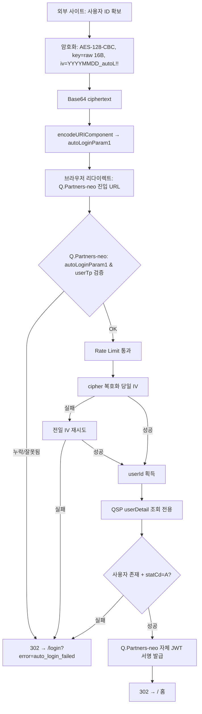

# 외부 사이트 → Q.Partners-neo 자동로그인 연동 가이드

> HANASYS DESIGN / Q.Order / Q.Musubi 등 외부 사이트에서 **Q.Partners-neo 로 자동로그인 진입**하기 위한 연동 가이드입니다.
> `autoLoginParam1` 생성(암호화)부터 Q.Partners-neo 에서 복호화 후 로그인 완료까지 **외부 사이트 개발자 관점**에서 정리했습니다.

- **Document version**: 2.0 (2026-04-30)
- **Target**: HANASYS DESIGN / Q.Order / Q.Musubi 개발팀
- **사양 정렬**: outbound (Q.Partners → 3사) 와 동일한 알고리즘·IV·평문·출력 — 양방향 가이드 통일

---

## 1. 한눈에 보는 흐름

1. 외부 사이트가 **사용자 ID 를 암호화**해 `autoLoginParam1` (Base64 + URL 인코딩) 을 생성한다.
2. 사용자 브라우저를 Q.Partners-neo 진입 URL 로 이동시킨다: `https://{q-partners-neo-host}/api/auth/auto-login/inbound?autoLoginParam1=<암호문>&userTp=<유형>`
3. Q.Partners-neo 진입 라우트가 **cipher 를 복호화해 userId 를 얻는다** — 유효한 cipher 는 공유 키 `AUTO_LOGIN_INBOUND_AES_KEY` 를 가진 신뢰된 외부 3사에서 발급된 인증 증명으로 간주한다.
4. Q.Partners-neo 가 QSP `userDetail` 을 호출해 사용자 메타데이터(회사·권한·상태)를 조회한다 — **비밀번호 검증 없음, 조회 전용**.
5. Q.Partners-neo 가 **자체 JWT 를 서명·발급**하여 httpOnly 쿠키로 설정한 뒤 **홈(`/`) 으로 리다이렉트** 한다. (QSP 로그인 API `/api/qpartners/user/login` 은 호출하지 않음 — 자세한 이유는 §5 참조)
6. 인증 실패 시 `/login?error=auto_login_failed` 로 폴백 (사용자는 일반 로그인 화면을 보게 됨).

---

## 2. 핵심 키 정보

### 암호화 키

| 항목 | 값 |
|---|---|
| 환경변수 이름 | `AUTO_LOGIN_INBOUND_AES_KEY` |
| 길이 | **정확히 16 byte (UTF-8 raw)** — AES-128-CBC 키로 그대로 사용 |
| 값 | **Q.Partners 운영팀과 별도 협의** — 보안 채널로 전달 |
| 공유 범위 | 외부 3사 (HANASYS / Q.Order / Q.Musubi) + Q.Partners-neo 서버 |
| 교체 주기 | 연 1회 내외 (교체 시 사전 공지) |
| outbound 키와의 관계 | **분리 운영** (`AUTO_LOGIN_OUTBOUND_AES_KEY` 와 다른 값) — 한쪽 compromise 시 영향 격리 |

### 키 사용 방식

```
aesKey = UTF-8(AUTO_LOGIN_INBOUND_AES_KEY)   // 정확히 16 byte
```

- **SHA-256 해싱·날짜 결합 없이** env 값을 그대로 raw key 로 사용한다.
- 길이가 16 byte 가 아니면 Q.Partners-neo 서버가 부팅 / 첫 요청 단계에서 즉시 거부한다.

### 운영 키 생성 가이드

raw 16 byte 를 직접 키로 사용하므로 (SHA-256 KDF 가 없음), **저엔트로피 시크릿은 사전 사전(dictionary) / 무차별 대입 공격에 취약**합니다. 운영 키는 반드시 OS 의 CSPRNG(`/dev/urandom`) 에서 직접 추출해 생성합니다.

| 방식 | 명령 | 출력 길이 | 비고 |
|---|---|---|---|
| **권장** — hex 16자 | `openssl rand -hex 8` | 16 byte UTF-8 (16자 hex `[0-9a-f]`) | 모든 환경 호환, copy-paste 안전 |
| 대안 — base64 12자 | `openssl rand -base64 9 \| head -c 12` | 12 byte UTF-8 ❌ | **사용 금지** — 12 byte 는 길이 검증에서 거부됨 |
| 대안 — Node.js | `node -e "console.log(require('crypto').randomBytes(8).toString('hex'))"` | 16 byte UTF-8 | 권장과 동일한 출력 형식 |

**금지 패턴**:
- 사람이 만든 비밀번호류 (예: `MyCompany2026!!`) — 사전 공격 가능
- 외부 가이드 문서·검증 스크립트의 샘플 키 — 운영 코드의 `timingSafeEqual` 가드로 즉시 거부됨
- 길이 16 이 아닌 값 — 부팅 / 첫 요청 단계에서 ConfigError 로 거부됨

**키 교체 절차** (외부 3사 협의 필요):
1. 위 명령으로 새 키 생성 → 운영팀이 보안 채널로 외부 3사에 사전 공유.
2. 사전 공지된 시각에 외부 3사 + Q.Partners-neo 양쪽 `AUTO_LOGIN_INBOUND_AES_KEY` env 값 교체.
3. 교체 시점 직전에 발급된 cipher 는 자정 경계 fallback (§2 IV) 으로 24h 내 자동 흡수되지 않음 — 키 자체가 바뀌면 전일 IV 시도도 실패. 짧은 다운타임 발생 가능성을 운영팀이 사전 공지.

### IV 사용 방식

```
iv = UTF-8(`${YYYYMMDD_KST}_autoL!!`)   // 정확히 16 byte (8 + 8)
```

- `YYYYMMDD_KST` 는 **KST(UTC+09:00) 기준** 오늘 날짜 (예: `20260430`).
- 접미사 `_autoL!!` 는 **고정 상수** — outbound 와 동일한 값으로 양방향 통일.
- 날짜가 바뀌면 IV 도 바뀌므로, **자정 경계**(KST 00:00)에 발급된 cipher 는 Q.Partners-neo 서버에서 **전일 IV 로 자동 재시도**하여 복호화한다.
- 외부 사이트는 **cipher 생성 시점의 KST 날짜**를 사용하면 된다.

---

## 3. 호출 URL 규격

### 진입 URL

```
GET https://{q-partners-neo-host}/api/auth/auto-login/inbound
    ?autoLoginParam1={URL_ENCODED_CIPHERTEXT}
    &userTp={USER_TP}
```

| 환경 | `{q-partners-neo-host}` |
|---|---|
| Development | `dev.q-partners.q-cells.jp` |
| Production | `www.q-partners.q-cells.jp` (확정 후 업데이트) |

### 쿼리 파라미터

| 파라미터 | 필수 | 설명 |
|---|---|---|
| `autoLoginParam1` | ✅ | URL-Encoded Base64(ciphertext). 아래 §4 규격에 따라 생성. **IV 는 별도로 송신하지 않음** — 수신측이 키와 일자 규칙으로 동일 IV 를 재구성. |
| `userTp` | ✅ | QSP 사용자 유형. 아래 값 중 하나: `ADMIN`, `STORE`, `SEKO`, `GENERAL`. |

### `userTp` 선정 기준

외부 사이트는 자기 서비스의 사용자가 Q.Partners-neo 에서 어떤 사용자 유형으로 등록되어 있는지 알고 있어야 합니다.

- **HANASYS DESIGN** / **Q.Order** / **Q.Musubi** 에서 공통으로 사용되는 Q.Partners 계정의 유형에 맞춰 설정.
- 사이트별 매핑 기준이 불명확하다면 Q.Partners 운영팀에 문의.
- 값이 틀리면 QSP `userDetail` 조회 단계에서 "사용자 없음" 으로 실패하여 자동로그인이 거부되고 일반 로그인 화면으로 폴백됨.

> ℹ️ `userTp` 는 변조 가능한 평문이지만, QSP 가 `(userTp, 식별자)` 조합을 실제 DB 에서 검증하므로 권한 상승으로 이어지지 않음. 추가로 진입 라우트는 QSP 응답의 `userTp` 와 쿼리 `userTp` 를 교차 검증한다.

### ⚠️ `userTp` 별 **cipher 에 실을 식별자**가 다름

| `userTp` | cipher 에 실어야 할 값 | 이유 |
|---|---|---|
| `ADMIN` / `STORE` / `SEKO` | **`loginId`** (예: `1301011`, `T01`) | Q.Partners-neo 가 QSP `userDetail` 을 `loginId` 파라미터로 조회함 |
| `GENERAL` | **`email`** (예: `user@example.com`) | Q.Partners-neo 가 QSP `userDetail` 을 `email` 파라미터로 조회함 |

값이 엇갈리면(예: GENERAL 에게 loginId 를 실어 보냄) QSP 가 회원을 찾지 못해 `F_NOT_USER` 응답 → 자동로그인 실패 폴백. 외부 사이트 측에서 `userTp` 에 맞는 식별자를 선택해서 cipher 평문으로 실어야 합니다.

---

## 4. 암호화 규격 상세

### 알고리즘

```
plaintext   = UTF-8(userId)                                    // e.g. "1301011"
aesKey      = UTF-8(AUTO_LOGIN_INBOUND_AES_KEY)                // 정확히 16 byte
iv          = UTF-8(`${YYYYMMDD_KST}_autoL!!`)                 // 정확히 16 byte
ciphertext  = AES-128-CBC(aesKey, iv, plaintext)               // PKCS5/PKCS7 Padding
cipher      = Base64(ciphertext)                               // IV prepend 없음
autoLoginParam1 = encodeURIComponent(cipher)
```

### IV prepend 가 없는 이유

- IV 가 (KST 일자 + 고정 상수) 로 결정적이라 **수신측이 cipher 만 받아도 동일 IV 를 재구성** 가능.
- 따라서 IV 를 별도로 송신하지 않음. cipher 페이로드 = ciphertext only.
- 같은 사용자 같은 날에는 동일 cipher 가 발생 — 이는 외부 3사 호환을 위한 의도된 동작.
- Q.Partners-neo 는 받는 측 1회용 차단을 두지 않음 (outbound 받는 측 정책과 통일) — 같은 cipher 로 24h 내 여러 번 진입 가능. 보안 측면은 §8 참조.

### 왜 `encodeURIComponent` 가 필요한가

- Base64 문자열에는 `+`, `/`, `=` 등 URL 예약문자가 포함될 수 있음.
- 쿼리스트링에 그대로 실으면 파라미터가 깨질 수 있어 **전송 전 반드시 인코딩**.
- Q.Partners-neo 서버는 Next.js 가 쿼리 파싱 시 자동 디코딩하므로 별도 `decodeURIComponent` 는 필요 없으나, 이중 인코딩은 금지.

### 샘플 코드 — Node.js

```javascript
const crypto = require("node:crypto");

function encryptAutoLoginUserId(userId, autoLoginInboundAesKey) {
  const now = new Date();
  const kst = new Date(now.getTime() + 9 * 60 * 60 * 1000);
  const yyyymmdd = `${kst.getUTCFullYear()}${String(kst.getUTCMonth() + 1).padStart(2, "0")}${String(kst.getUTCDate()).padStart(2, "0")}`;

  const key = Buffer.from(autoLoginInboundAesKey, "utf8");          // 16 byte
  const iv  = Buffer.from(`${yyyymmdd}_autoL!!`, "utf8");           // 16 byte

  const cipher = crypto.createCipheriv("aes-128-cbc", key, iv);
  const ciphertext = Buffer.concat([cipher.update(userId, "utf8"), cipher.final()]);

  return encodeURIComponent(ciphertext.toString("base64"));
}

// 사용 예
const autoLoginParam1 = encryptAutoLoginUserId("1301011", process.env.AUTO_LOGIN_INBOUND_AES_KEY);
const userTp = "ADMIN";
const redirectUrl = `https://dev.q-partners.q-cells.jp/api/auth/auto-login/inbound?autoLoginParam1=${autoLoginParam1}&userTp=${userTp}`;
```

### 샘플 코드 — Java

```java
import javax.crypto.Cipher;
import javax.crypto.spec.IvParameterSpec;
import javax.crypto.spec.SecretKeySpec;
import java.net.URLEncoder;
import java.nio.charset.StandardCharsets;
import java.time.LocalDate;
import java.time.ZoneId;
import java.time.format.DateTimeFormatter;
import java.util.Base64;

public static String encryptAutoLoginUserId(String userId, String autoLoginInboundAesKey) throws Exception {
    String yyyymmdd = LocalDate.now(ZoneId.of("Asia/Seoul")).format(DateTimeFormatter.ofPattern("yyyyMMdd"));
    byte[] keyBytes = autoLoginInboundAesKey.getBytes(StandardCharsets.UTF_8);   // 16 byte
    byte[] ivBytes  = (yyyymmdd + "_autoL!!").getBytes(StandardCharsets.UTF_8);  // 16 byte

    SecretKeySpec keySpec = new SecretKeySpec(keyBytes, "AES");                  // 16 byte → AES-128 자동 결정
    IvParameterSpec ivSpec = new IvParameterSpec(ivBytes);

    Cipher cipher = Cipher.getInstance("AES/CBC/PKCS5Padding");
    cipher.init(Cipher.ENCRYPT_MODE, keySpec, ivSpec);
    byte[] ciphertext = cipher.doFinal(userId.getBytes(StandardCharsets.UTF_8));

    String base64 = Base64.getEncoder().encodeToString(ciphertext);
    return URLEncoder.encode(base64, StandardCharsets.UTF_8);
}
```

### 검증 샘플 (참고용)

| userId | KST 일자 | IV | 기대 cipher (Base64, URL 인코딩 전) |
|---|---|---|---|
| `T01` | `20260424` | `20260424_autoL!!` | `pQE3A9NO+KCt6q2hD/Bhzw==` |
| `201T01` | `20260424` | `20260424_autoL!!` | `GpvgC+3aY/fPBItoF6+Cdg==` |

> 위 샘플은 키 `jpqcellQ123456!!` (16 byte 자바 원본 검증용 키) 기준이며, 실제 운영 키는 별도 협의된 값을 사용한다. 자체 구현 검증 시 위 키·IV·평문 조합으로 동일 cipher 가 나오는지 확인하면 알고리즘 정합성을 빠르게 검증할 수 있다.
>
> Q.Partners-neo 동봉 검증 스크립트(`scripts/verify-auto-login-inbound-crypto.mjs`)는 git 트리에 샘플 키를 박지 않고 **`VERIFY_SAMPLE_KEY` env 로 주입**받는다. 위 byte-level 일치를 재현하려면 다음과 같이 실행한다.
>
> ```bash
> VERIFY_SAMPLE_KEY="jpqcellQ123456!!" node scripts/verify-auto-login-inbound-crypto.mjs
> ```
>
> env 미설정 시 (A)/(B) 는 SKIP 되고 (C)/(D)/(E) 만 임시 랜덤 키로 실행된다 — 알고리즘 로직만 검증한다.

---

## 5. Q.Partners-neo 서버 동작

진입 URL `GET /api/auth/auto-login/inbound` 은 다음 순서로 동작합니다.

1. 쿼리 `autoLoginParam1`, `userTp` 검증 — 누락 / 잘못된 값 → **302** `/login?error=auto_login_failed`
2. Rate Limit (IP 20/분) — IP 식별 불가 시 fail-closed.
3. cipher Base64 디코딩 → 당일 IV 로 AES-128-CBC 복호화 시도.
4. 실패 시 전일 IV 로 재시도 (자정 경계 보정). 두 번 모두 실패 → **302** 폴백.
5. 복호화된 `userId` + 쿼리 `userTp` 로 **QSP `userDetail` (조회 전용)** 호출 — 메타데이터·권한 조회. `F_NOT_USER` 등 실패 시 **302** 폴백.
6. QSP 응답의 `userTp` 와 쿼리 `userTp` 교차 검증 (변조 방어). 불일치 → **302** 폴백.
7. `statCd === "A"` (활성) 검증 — 삭제·탈퇴 계정 거부.
8. authRole 결정 (DB 우선, 실패 시 fail-closed 폴백). `SUPER_ADMIN` 자동로그인 거부, `ADMIN` 은 감사 로그 + 2FA 강제.
9. Q.Partners-neo 자체 JWT 서명·발급 → Set-Cookie 전파 + **302** `/` (홈).

> ℹ️ cipher 1회용 소진 검사는 두지 않습니다. 같은 사용자가 같은 날 여러 번 진입할 수 있으며, 이는 outbound 받는 측 (외부 3사) 정책과 통일된 동작입니다. 받아들인 위험: cipher 탈취 시 24h 내 재사용 가능 — 외부 3사 측 cipher 노출 표면 (브라우저 히스토리 / Referer / 로그) 의 표준 보호에 의존합니다.

### 왜 QSP 로그인 API 를 호출하지 않나

AS-IS Q.Partners 레거시는 자체 로그인 API(`/api/qpartners/user/login`) 에 `loginKey: "jpcellautologin!!"` 를 보내면 비밀번호 검증을 스킵하는 "자동로그인 모드" 가 있었습니다. 그러나 **Q.Partners-neo 가 프록시하는 QSP (Connector API v1.0) 는 해당 모드를 지원하지 않습니다** — `loginKey` 파라미터 자체가 사양서에 없음.

대신 Q.Partners-neo 는 다음 사실을 근거로 자체 세션을 발급합니다.

- cipher 는 공유 키 `AUTO_LOGIN_INBOUND_AES_KEY` 를 가진 자만 생성 가능.
- 이 키는 Q.Partners 운영팀이 외부 3사에게만 공유하는 비밀값.
- 따라서 **유효한 cipher 를 복호화할 수 있다는 것 자체가 인증의 근거**로 성립.

QSP `userDetail` 은 사용자 정보 조회(이름·회사·권한 등) 용도로만 사용되며, 비밀번호 검증은 수행하지 않습니다.

---

## 6. 외부 사이트 구현 체크리스트

- [ ] Q.Partners 운영팀에서 받은 `AUTO_LOGIN_INBOUND_AES_KEY` 를 **안전한 시크릿 저장소**(Vault / SSM / 환경변수 등)에 저장. 레포지토리 커밋 금지.
- [ ] 키는 **정확히 16 byte UTF-8** 인지 확인 — 따옴표 / 공백 / 개행이 섞이지 않도록 주의.
- [ ] 알고리즘은 **AES-128-CBC** + PKCS5/PKCS7 Padding. AES-256 / GCM / CTR 사용 금지.
- [ ] IV 는 `YYYYMMDD_autoL!!` (KST 기준, 16 byte) **결정적 값** — 랜덤 IV 생성 금지.
- [ ] cipher 페이로드는 **ciphertext only** (Base64). IV prepend 금지.
- [ ] `encodeURIComponent` 로 URL 인코딩 후 쿼리에 실을 것. 이중 인코딩 금지.
- [ ] `userTp` 값을 사용자별로 결정하고 Q.Partners 운영팀과 합의.
- [ ] `userTp` 별 cipher 평문 식별자 매핑 확인 (`ADMIN/STORE/SEKO`=loginId, `GENERAL`=email).
- [ ] **SUPER_ADMIN 계정은 자동로그인 미지원** — 외부 3사에서 `userTp=ADMIN` 으로 보내더라도 Q.Partners-neo 가 authRole 결정 단계에서 `SUPER_ADMIN` 으로 판정되면 거부하고 `/login?error=auto_login_failed` 로 폴백한다 (고권한 계정 보호 정책). 외부 3사 측에서 SUPER_ADMIN 사용자에게는 자동로그인 링크를 노출하지 않거나, 폴백 시 일반 로그인으로 안내할 것.
- [ ] KST(UTC+09:00) 기준 날짜를 사용할 것. 서버 OS 타임존 의존 금지 — 명시적으로 `+9h` 오프셋 적용.
- [ ] 자정 경계에 발급된 cipher 가 복호화 실패할 수 있음을 고려 (Q.Partners-neo 가 전일 IV 로 자동 재시도하므로 통상 문제없음).
- [ ] 자동로그인 실패 시 UX: Q.Partners-neo 가 `/login?error=auto_login_failed` 로 리다이렉트하므로, **외부 사이트 측에서는 별도 폴백 처리 불필요**.
- [ ] HTTPS 로만 호출할 것.

---

## 7. 프로세스 다이어그램



---

## 8. 트러블슈팅

| 증상 | 원인 후보 | 대응 |
|---|---|---|
| 항상 `/login?error=auto_login_failed` 로 폴백 | 키 불일치 (외부 사이트 ↔ Q.Partners-neo) / 키 길이 16 byte 위반 | `AUTO_LOGIN_INBOUND_AES_KEY` 재확인, 값 앞뒤 공백 / 줄바꿈 / 따옴표 제거, byte length 정확히 16 인지 확인 |
| 자정 전후만 실패 | KST 날짜 계산 오류 | 서버 OS 타임존 의존 대신 명시적 `+9h` 적용 |
| 쿼리 파싱 에러 | URL 인코딩 누락 또는 이중 인코딩 | `encodeURIComponent` 한 번만 적용 |
| `userTp` 불일치로 인증 실패 | 외부 사이트가 가진 userTp 매핑이 Q.Partners DB 와 다름 | 운영팀과 사용자별 userTp 확인 |
| 첫 블록만 풀리고 padding 에러 | IV 가 16 byte 가 아님 (suffix 변경 등) | suffix 가 정확히 `_autoL!!` (8 byte ASCII) 인지 확인 |
| 첫 진입은 되는데 새로고침이 안 됨 | 정상 — 자동로그인은 SSO 진입 1회 용도. 이후는 Q.Partners-neo JWT 쿠키로 일반 인증 유지 | 사용자 동작 정상 |

### 받아들인 위험 — cipher 24h 재사용 가능성

결정적 IV 사양상 같은 사용자 같은 날 cipher 가 동일합니다. Q.Partners-neo 는 받는 측 1회용 차단을 두지 않으므로 다음 위험을 받아들입니다.

- **위험**: cipher 가 탈취되면 24h 내 누구나 그 사용자로 자동로그인 가능
- **노출 표면**: 진입 URL 의 쿼리 파라미터 → 브라우저 주소창·히스토리·Referer 헤더·서버 액세스 로그 등
- **외부 3사 inbound 동일 위험**: 외부 3사도 매번 통과 정책으로 동일한 24h 재사용 위험을 안고 있습니다
- **표준 대응**: HTTPS 사용, 진입 URL 로그 마스킹·접근 권한 제한 (외부 3사 측·Q.Partners-neo 측 양쪽 동일)
- **추가 강화 필요 시**: 평문에 nonce/타임스탬프 포함하는 사양 확장 검토 (현재 Out of Scope, 외부 3사와 합의 필요)

---

## 9. 변경 이력

| 버전 | 날짜 | 변경사항 |
|---|---|---|
| 1.0 | 2026-04-22 | 초안 작성 — AES-256-CBC + SHA-256(YYYYMMDD_KST + AUTO_LOGIN_AES_KEY) + 랜덤 IV (Base64(IV‖CT)) |
| **2.0** | **2026-04-30** | **사양 재정렬 — outbound 와 통일** (AES-128-CBC + raw 16B key + 결정적 IV `YYYYMMDD_autoL!!` + Base64(ciphertext)). 환경변수명 `AUTO_LOGIN_AES_KEY` → `AUTO_LOGIN_INBOUND_AES_KEY` 로 분리. 3사 측 inbound encrypt 미구현 시점에 변경하여 호환 부담 0. |
| **2.1** | **2026-04-30** | **cipher 1회용 차단 제거** — outbound 받는 측 (외부 3사) 정책과 통일. 같은 사용자 같은 날 여러 번 inbound 진입 가능. cipher 24h 재사용 위험은 §8 명시. |
