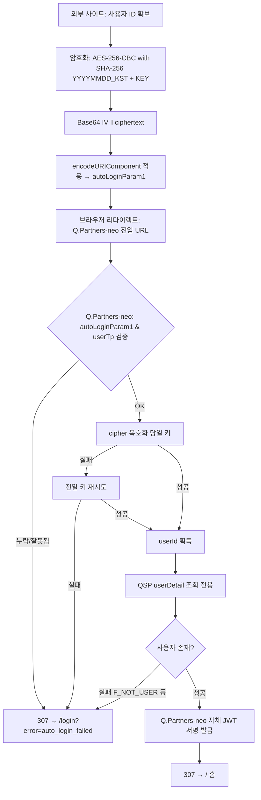

# 외부 사이트 → Q.Partners-neo 자동로그인 연동 가이드

> HANASYS DESIGN / Q.Order / Q.Musubi 와 같은 외부 사이트에서 **Q.Partners-neo 로 자동로그인 진입**하기 위한 연동 가이드입니다.
> `autoLoginParam1` 생성(암호화)부터 Q.Partners-neo 에서 복호화 후 로그인 완료까지를 **외부 사이트 개발자 관점**에서 정리했습니다.

- **Document version**: 1.0 (2026-04-22)
- **Target**: HANASYS DESIGN / Q.Order / Q.Musubi 개발팀
- **호환 AS-IS**: Q.Partners(레거시) `/eos/login/autoLogin` 자동로그인 규격

---

## 1. 한눈에 보는 흐름

1. 외부 사이트가 **사용자 ID 를 암호화**해 `autoLoginParam1` (Base64 + URL 인코딩) 을 생성한다.
2. 사용자 브라우저를 Q.Partners-neo 진입 URL 로 이동시킨다: `https://{q-partners-neo-host}/api/auth/auto-login/inbound?autoLoginParam1=<암호문>&userTp=<유형>`
3. Q.Partners-neo 진입 라우트가 **cipher 를 복호화해 userId 를 얻는다** — 유효한 cipher 는 공유 키 `AUTO_LOGIN_AES_KEY` 를 가진 신뢰된 외부 3사에서 발급된 인증 증명으로 간주한다.
4. Q.Partners-neo 가 QSP `userDetail` 을 호출해 사용자 메타데이터(회사·권한·상태)를 조회한다 — **비밀번호 검증 없음, 조회 전용**.
5. Q.Partners-neo 가 **자체 JWT 를 서명·발급**하여 httpOnly 쿠키로 설정한 뒤 **홈(`/`) 으로 리다이렉트** 한다. (QSP 로그인 API `/api/qpartners/user/login` 은 호출하지 않음 — 자세한 이유는 §5 참조)
6. 인증 실패 시 `/login?error=auto_login_failed` 로 폴백 (사용자는 일반 로그인 화면을 보게 됨).

---

## 2. 핵심 키 정보

### 암호화 키

| 항목 | 값 |
|---|---|
| 환경변수 이름 | `AUTO_LOGIN_AES_KEY` |
| 값 | **Q.Partners 운영팀과 별도 협의** — 카톡 또는 보안 채널로 전달 |
| 공유 범위 | 외부 3사 (HANASYS / Q.Order / Q.Musubi) + Q.Partners-neo 서버 |
| 교체 주기 | 연 1회 내외 (교체 시 사전 공지) |

### 키 조합식

```
cryptoKeyString = YYYYMMDD_KST + AUTO_LOGIN_AES_KEY
aesKey          = SHA-256(cryptoKeyString)   // 32 bytes
```

- `YYYYMMDD_KST` 는 **KST(UTC+09:00) 기준** 오늘 날짜 (예: `20260422`).
- 날짜가 바뀌면 키도 바뀌므로, **자정 경계**(KST 00:00)에 발급된 cipher 는 Q.Partners-neo 서버에서 **전일 키로 자동 재시도**하여 복호화한다.
- 이 재시도는 자정 직후 ±몇 분의 오차를 흡수하기 위한 보정 장치이며, 키 노출 방어의 일부는 아니다. 외부 사이트는 **cipher 생성 시점의 KST 날짜**를 사용하면 된다.

---

## 3. 호출 URL 규격

### 진입 URL

```
GET https://{q-partners-neo-host}/api/auth/auto-login/inbound
    ?autoLoginParam1={URL_ENCODED_CIPHERTEXT}
    &userTp={USER_TP}
```

| 환경 | `{q-partners-neo-host}` |
|---|---|
| Development | `dev.q-partners.q-cells.jp` |
| Production | `www.q-partners.q-cells.jp` (확정 후 업데이트) |

### 쿼리 파라미터

| 파라미터 | 필수 | 설명 |
|---|---|---|
| `autoLoginParam1` | ✅ | URL-Encoded Base64(IV ‖ ciphertext). 아래 §4 규격에 따라 생성. |
| `userTp` | ✅ | QSP 사용자 유형. 아래 값 중 하나: `ADMIN`, `STORE`, `SEKO`, `GENERAL`. |

### `userTp` 선정 기준

외부 사이트는 자기 서비스의 사용자가 Q.Partners-neo 에서 어떤 사용자 유형으로 등록되어 있는지 알고 있어야 합니다.

- **HANASYS DESIGN** / **Q.Order** / **Q.Musubi** 에서 공통으로 사용되는 Q.Partners 계정의 유형에 맞춰 설정.
- 사이트별 매핑 기준이 불명확하다면 Q.Partners 운영팀에 문의.
- 값이 틀리면 QSP `userDetail` 조회 단계에서 "사용자 없음" 으로 실패하여 자동로그인이 거부되고 일반 로그인 화면으로 폴백됨.

> ℹ️ `userTp` 는 변조 가능한 평문이지만, QSP 가 `(userTp, 식별자)` 조합을 실제 DB 에서 검증하므로 권한 상승으로 이어지지 않음.

### ⚠️ `userTp` 별 **cipher 에 실을 식별자**가 다름

| `userTp` | cipher 에 실어야 할 값 | 이유 |
|---|---|---|
| `ADMIN` / `STORE` / `SEKO` | **`loginId`** (예: `1301011`, `T01`) | Q.Partners-neo 가 QSP `userDetail` 을 `loginId` 파라미터로 조회함 |
| `GENERAL` | **`email`** (예: `user@example.com`) | Q.Partners-neo 가 QSP `userDetail` 을 `email` 파라미터로 조회함 |

값이 엇갈리면(예: GENERAL 에게 loginId 를 실어 보냄) QSP 가 회원을 찾지 못해 `F_NOT_USER` 응답 → 자동로그인 실패 폴백. 외부 사이트 측에서 `userTp` 에 맞는 식별자를 선택해서 cipher 평문으로 실어야 합니다.

---

## 4. 암호화 규격 상세

### 알고리즘

```
plaintext   = UTF-8(userId)                        // e.g. "1301011"
aesKey      = SHA-256(YYYYMMDD_KST + AUTO_LOGIN_AES_KEY)   // 32 bytes
iv          = crypto.randomBytes(16)               // 요청마다 새로 생성
ciphertext  = AES-256-CBC(aesKey, iv, plaintext)   // PKCS5/PKCS7 Padding
cipherBytes = iv ‖ ciphertext                      // IV 를 앞에 prepend
cipher      = Base64(cipherBytes)
autoLoginParam1 = encodeURIComponent(cipher)
```

### 왜 요청마다 새 IV 를 만드나

- IV 를 고정하면 동일 userId → 동일 cipher 가 되어 **Replay 공격 / 사용자 상관 분석** 에 취약.
- `crypto.randomBytes(16)` 으로 요청마다 IV 를 새로 만들면 IND-CPA 안전성 (NIST SP 800-38A) 을 충족.
- IV 는 비밀이 아니므로 ciphertext 앞에 그대로 prepend 해서 전송 → 복호화 측에서 첫 16 바이트를 IV 로 분리.

### 왜 `encodeURIComponent` 가 필요한가

- Base64 문자열에는 `+`, `/`, `=` 등 URL 예약문자가 포함될 수 있음.
- 쿼리스트링에 그대로 실으면 파라미터가 깨질 수 있어 **전송 전 반드시 인코딩**.
- Q.Partners-neo 서버는 Next.js 가 쿼리 파싱 시 자동 디코딩하므로 별도 `decodeURIComponent` 는 필요 없으나, 이중 인코딩은 금지.

### 샘플 코드 — Node.js

```javascript
const crypto = require("node:crypto");

function encryptAutoLoginUserId(userId, autoLoginAesKey) {
  const now = new Date();
  const kst = new Date(now.getTime() + 9 * 60 * 60 * 1000);
  const yyyymmdd = `${kst.getUTCFullYear()}${String(kst.getUTCMonth() + 1).padStart(2, "0")}${String(kst.getUTCDate()).padStart(2, "0")}`;

  const aesKey = crypto.createHash("sha256").update(yyyymmdd + autoLoginAesKey, "utf8").digest();
  const iv = crypto.randomBytes(16);

  const cipher = crypto.createCipheriv("aes-256-cbc", aesKey, iv);
  const ciphertext = Buffer.concat([cipher.update(userId, "utf8"), cipher.final()]);

  const cipherBytes = Buffer.concat([iv, ciphertext]);
  return encodeURIComponent(cipherBytes.toString("base64"));
}

// 사용 예
const autoLoginParam1 = encryptAutoLoginUserId("1301011", process.env.AUTO_LOGIN_AES_KEY);
const userTp = "ADMIN";
const redirectUrl = `https://dev.q-partners.q-cells.jp/api/auth/auto-login/inbound?autoLoginParam1=${autoLoginParam1}&userTp=${userTp}`;
```

### 샘플 의사코드 — Java / 기타 언어

```
byte[] aesKey   = SHA256(yyyymmddKst + AUTO_LOGIN_AES_KEY);            // 32 bytes
byte[] iv       = SecureRandom(16);
byte[] cipherT  = AES.encrypt("AES/CBC/PKCS5Padding", aesKey, iv, plaintext);
byte[] payload  = concat(iv, cipherT);
String cipher   = Base64.encode(payload);
String param    = URLEncoder.encode(cipher, "UTF-8");
```

---

## 5. Q.Partners-neo 서버 동작

진입 URL `GET /api/auth/auto-login/inbound` 은 다음 순서로 동작합니다.

1. 쿼리 `autoLoginParam1`, `userTp` 검증 — 누락 / 잘못된 값 → **307** `/login?error=auto_login_failed`
2. Base64 디코딩 → 첫 16 바이트를 IV 로 분리 → 나머지를 AES-256-CBC ciphertext 로 해석
3. 당일 키로 복호화 시도, 실패 시 전일 키로 재시도 (자정 경계 보정)
4. 복호화 실패 → **307** `/login?error=auto_login_failed`
5. 복호화된 `userId` + 쿼리 `userTp` 로 **QSP `userDetail` (조회 전용)** 호출 — 사용자 메타데이터·권한 조회. `F_NOT_USER` 등 실패 시 **307** 폴백.
6. Q.Partners-neo 가 사용자 정보로 **자체 JWT 서명·발급** → Set-Cookie 전파 + **307** `/` (홈).
7. JWT 서명 실패 등 내부 오류 → **307** `/login?error=auto_login_failed`.

### 왜 QSP 로그인 API 를 호출하지 않나

AS-IS Q.Partners 레거시는 자체 로그인 API(`/api/qpartners/user/login`) 에 `loginKey: "jpcellautologin!!"` 를 보내면 비밀번호 검증을 스킵하는 "자동로그인 모드" 가 있었습니다. 그러나 **Q.Partners-neo 가 프록시하는 QSP (Connector API v1.0) 는 해당 모드를 지원하지 않습니다** — `loginKey` 파라미터 자체가 사양서에 없음.

대신 Q.Partners-neo 는 다음 사실을 근거로 자체 세션을 발급합니다.

- cipher 는 공유 키 `AUTO_LOGIN_AES_KEY` 를 가진 자만 생성 가능.
- 이 키는 Q.Partners 운영팀이 외부 3사에게만 공유하는 비밀값.
- 따라서 **유효한 cipher 를 복호화할 수 있다는 것 자체가 인증의 근거**로 성립.

QSP `userDetail` 은 사용자 정보 조회(이름·회사·권한 등) 용도로만 사용되며, 비밀번호 검증은 수행하지 않습니다.

### 테스트용 보조 엔드포인트 (참고)

Q.Partners-neo 에는 개발·디버깅 편의용으로 `POST /api/auth/auto-login/encrypt` (인증 필요) 가 있을 수 있습니다. 외부 사이트의 암복호화 로직을 서버 동작과 맞추기 위한 **왕복 테스트** 용도이며, 운영 트래픽에서는 사용하지 않습니다. 필요 시 운영팀에 요청해주세요.

---

## 6. 외부 사이트 구현 체크리스트

- [ ] Q.Partners 운영팀에서 받은 `AUTO_LOGIN_AES_KEY` 를 **안전한 시크릿 저장소**(Vault / SSM / 환경변수 등)에 저장. 레포지토리 커밋 금지.
- [ ] 암호화는 **요청마다 새 IV** 를 생성할 것 (고정 IV 금지).
- [ ] `encodeURIComponent` 로 URL 인코딩 후 쿼리에 실을 것. 이중 인코딩 금지.
- [ ] `userTp` 값을 하드코딩할지 사용자마다 다르게 할지 결정하고 Q.Partners 운영팀과 합의.
- [ ] KST(UTC+09:00) 기준 날짜를 사용할 것. 서버 OS 타임존 의존 금지 — 명시적으로 `+9h` 오프셋 적용.
- [ ] 자정 경계에 발급된 cipher 가 복호화 실패할 수 있음을 고려 (Q.Partners-neo 가 전일 키로 자동 재시도하므로 통상 문제없음).
- [ ] 자동로그인 실패 시 UX: Q.Partners-neo 가 `/login?error=auto_login_failed` 로 리다이렉트하므로, **외부 사이트 측에서는 별도 폴백 처리 불필요**.
- [ ] HTTPS 로만 호출할 것 (Q.Partners-neo 는 평문 HTTP 리다이렉트를 허용하지 않음).

---

## 7. 프로세스 다이어그램



---

## 8. 트러블슈팅

| 증상 | 원인 후보 | 대응 |
|---|---|---|
| 항상 `/login?error=auto_login_failed` 로 폴백 | 키 불일치 (외부 사이트 ↔ Q.Partners-neo) | `AUTO_LOGIN_AES_KEY` 재확인, 값 앞뒤 공백 / 줄바꿈 제거 |
| 자정 전후만 실패 | KST 날짜 계산 오류 | 서버 OS 타임존 의존 대신 명시적 `+9h` 적용 |
| 쿼리 파싱 에러 | URL 인코딩 누락 또는 이중 인코딩 | `encodeURIComponent` 한 번만 적용 |
| `userTp` 불일치로 인증 실패 | 외부 사이트가 가진 userTp 매핑이 Q.Partners DB 와 다름 | 운영팀과 사용자별 userTp 확인 |
| 간헐적 복호화 실패 | IV 생성 방식 오류 (CSPRNG 아닌 Math.random 사용 등) | `crypto.randomBytes` / `SecureRandom` 사용 확인 |

---

## 9. 변경 이력

| 버전 | 날짜 | 변경사항 |
|---|---|---|
| 1.0 | 2026-04-22 | 초안 작성 (AS-IS Q.Order 가이드 구조 미러링, 방향 반전) |
